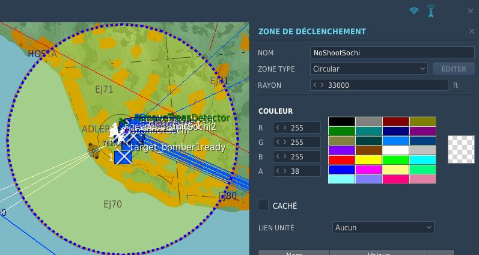

# DCS NoShootZone script 💥
Script to give a sanction to a player shooting in a forbidden zone.

<ins>How to install it?</ins>
- Open your mission in the mission editor
- Mist script is mandatory, load it first in your mission! https://github.com/mrSkortch/MissionScriptingTools
- Place zones (circle and/or rectangle) where you want the shots to be forbidden

- In the DCS-NoShootOrKickGameGUI.lua file, add all the zone names in the zone_names list : local zone_names = {'zone1','zone2','zone3','zone4'} -- Put how much you want, can be separate airfields
- Load the script
- Host your mission and enjoy 😏

<ins>What I ask in exchange?</ins>
- Mention a small credit to me in your server/mission 🥰

If any question, find me on my Discord in a public channel (no DM, your question can help other people 😉 ) =>

Licence: Creative Commons Attribution-NonCommercial 3.0 Unported